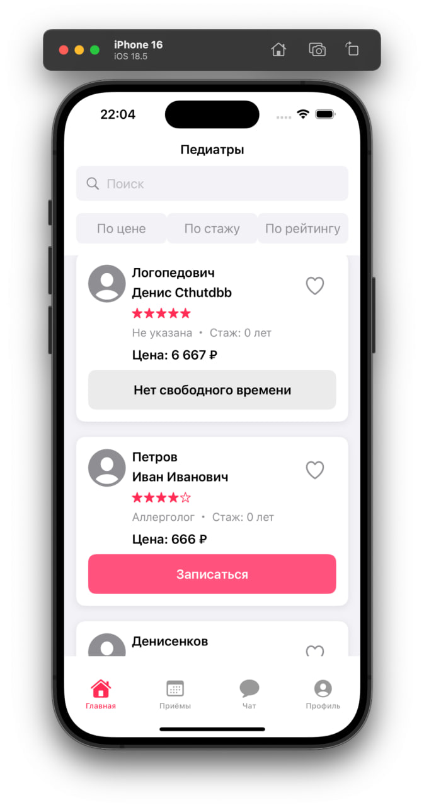
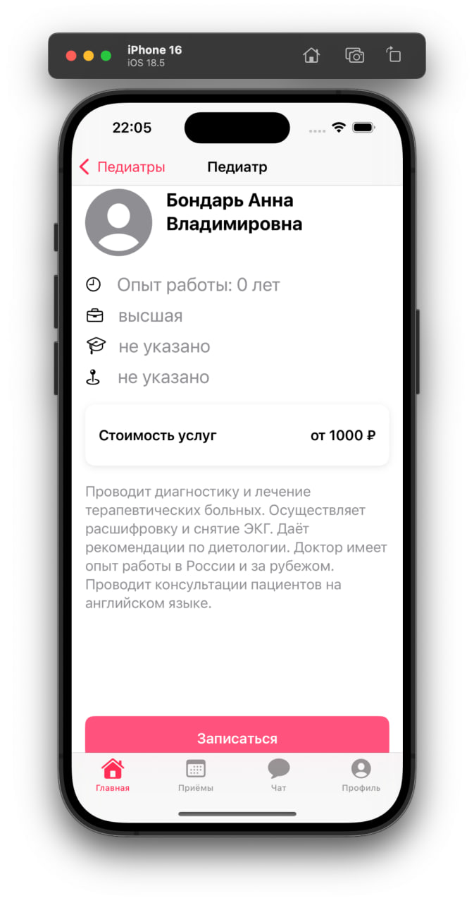

# PediatrApp
iOS-приложение для отбора на стажировку после курса iOS-разработки. Представляет из себя обычный список врачей, вся информация взята из предоставленного json файла. Есть возможность фильтрации врачей.

## 🛠 Стек
- Swift 5, SwiftUI
- MVVM архитектура
- JSON файл и декодирование

## 📸 Скриншоты
<table>
<tr>
<td></td>
<td></td>
</tr>
</table>
